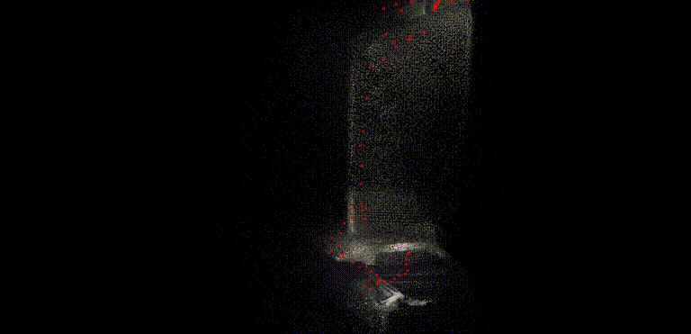
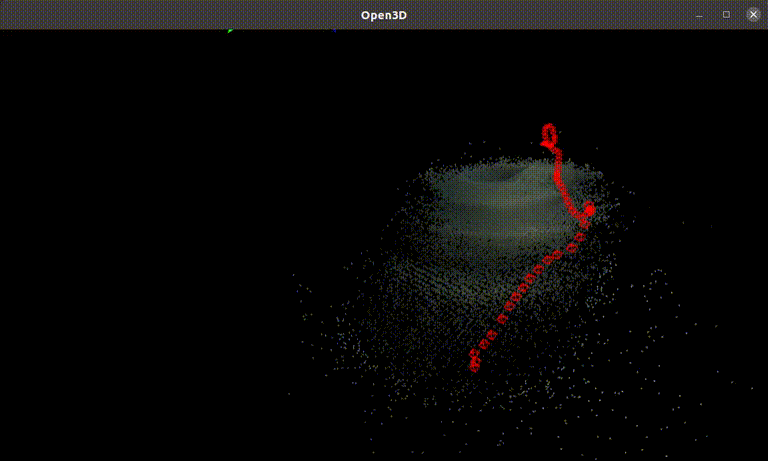

# Robot localization with monocular camera

- SLAM-based method for monocular image based localization
- Single camera of 1.05mm diameter 
- Camera calibration (estimation of intrinsic parameters)
- Textureless environment
- Evaluation with Aurora Electromagnetic Tracking and 3D CAD points

<p align="center">
  
</p>
<p align="center">
  
</p>

## Installation 
1. Creating a new anaconda environment using the provided .yaml file.
```Bash
conda env create -f environment.yaml
pip install evo --upgrade --no-binary evo
pip install gdown
```

2. Compile the extensions (takes about 10 minutes)
```Bash
python setup.py install
```

## Data

Place your video frames under ```/data``` directory similar to the example ```POV_4_0```:
   ```
       data/
       ├── POV_4_0/
             ├── left/
                ├── 00000.png
                ├── 00001.png
                ├── 00002.png
                ├── 00003.png
                ├── ...
   ```

## Camera calibration

Place the output of the camera calibration under ```/calib``` directory similar to the example ```cam_calib_POV_4_0.json```.
Camera calibration can be performed in Matlab or OpenCV.

## Demo
Run the following:
```Bash
conda activate droidenv
python test.py --imagedir=data/POV_4_0 --calib=calib/cam_calib_POV_4_0.json  --reconstruction_path "reconstructions/POV_4_0"--stride=3
```
Outputs are saved in ```/reconstructions``` directory.

## Acknowledgements

The project is heavily based on DROID-SLAM github repo: ```https://github.com/princeton-vl/DROID-SLAM.git``` 


